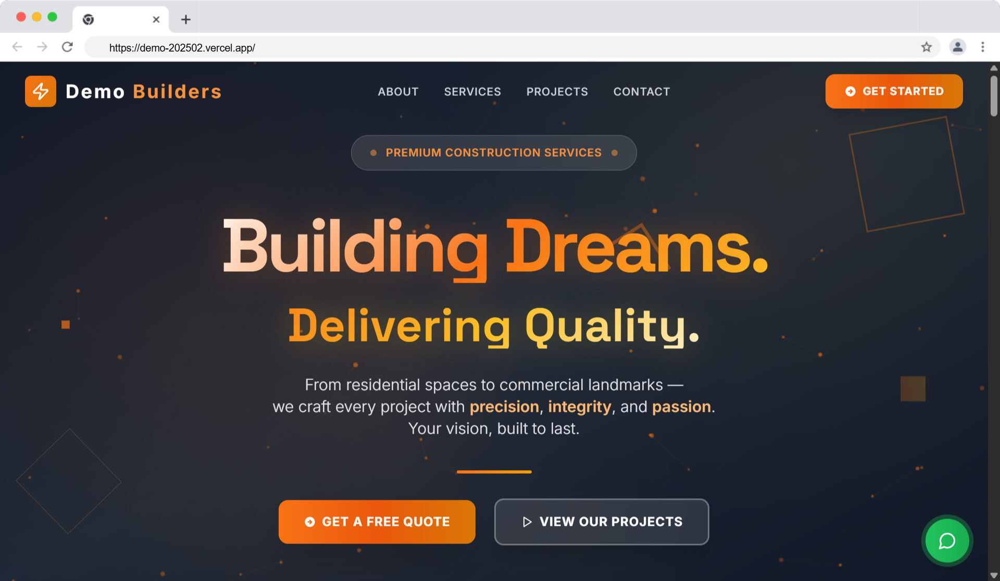

# AG Builders Website

[](https://github.com/your-repo/ag-builders-website)
[](https://github.com/your-repo/ag-builders-website)
[](LICENSE)



A modern, responsive, and feature-rich website for AG Builders - a premier construction and infrastructure development company specializing in residential, commercial, and industrial building projects.

## 🌟 Features

- **Modern Design**: Clean, professional design with smooth animations
- **Responsive**: Optimized for all devices (mobile, tablet, desktop)
- **Interactive**: Engaging user interface with Framer Motion animations
- **Performance**: Fast loading with optimized assets and code splitting
- **SEO Ready**: Semantic HTML structure and meta tags
- **Contact Integration**: WhatsApp float button and contact forms
- **Project Portfolio**: Showcase of residential, commercial, and industrial projects
- **Service Catalog**: Comprehensive listing of construction services
- **Client Testimonials**: Social proof through customer reviews

## 🚀 Quick Start

### Prerequisites
- **Node.js** 18.x or higher
- **npm** 9.x or higher

### Installation

1. **Clone the repository**
   ```bash
   git clone https://github.com/your-username/ag-builders-website.git
   cd ag-builders-website
   ```

2. **Install dependencies**
   ```bash
   npm install
   ```

3. **Set up environment variables**
   ```bash
   cp .env.example .env.local
   ```
   
   Edit `.env.local` and add your configuration:
   ```env
   GEMINI_API_KEY=your_gemini_api_key_here
   VITE_CONTACT_PHONE=your_phone_number
   VITE_CONTACT_EMAIL=your_email@domain.com
   ```

4. **Start development server**
   ```bash
   npm run dev
   ```

5. **Open in browser**
   Navigate to [http://localhost:3000](http://localhost:3000)

## 🛠️ Available Scripts

| Script | Description |
|--------|-------------|
| `npm run dev` | Start development server with hot reload |
| `npm run build` | Build for production |
| `npm run build:prod` | Production build with type checking |
| `npm run preview` | Preview production build locally |
| `npm run serve` | Build and serve production version |
| `npm run lint` | Run TypeScript type checking |
| `npm run type-check` | Check TypeScript types without emitting |

## 🏗️ Tech Stack

- **Frontend Framework**: React 19.2.0
- **Build Tool**: Vite 6.2.0
- **Language**: TypeScript 5.8.2
- **Styling**: Tailwind CSS (via CDN)
- **Animations**: Framer Motion 11.0.0
- **Icons**: Lucide React 0.400.0
- **Utilities**: React Intersection Observer 9.13.0

## 📁 Project Structure

```
ag-builders-website/
├── public/                 # Static assets
├── components/            # React components
│   ├── Header.tsx        # Navigation header
│   ├── Hero.tsx          # Hero section with animations
│   ├── About.tsx         # About company section
│   ├── Services.tsx      # Services showcase
│   ├── Projects.tsx      # Project portfolio
│   ├── Testimonials.tsx  # Client testimonials
│   ├── Contact.tsx       # Contact form and info
│   ├── Footer.tsx        # Site footer
│   ├── LoadingScreen.tsx # Loading animation
│   ├── LoadingSpinner.tsx # Loading spinner component
│   ├── ParticleBackground.tsx # Animated background
│   └── WhatsAppFloat.tsx # WhatsApp floating button
├── App.tsx               # Main application component
├── index.tsx            # Application entry point
├── constants.tsx        # Application constants and data
├── types.ts             # TypeScript type definitions
├── vite.config.ts       # Vite configuration
├── tsconfig.json        # TypeScript configuration
├── package.json         # Dependencies and scripts
└── README.md           # Project documentation
```

## 🎨 Customization

### Company Information
Update company details in `constants.tsx`:

```typescript
export const CONTACT_INFO = {
  phone: "1234567890",           // WhatsApp number
  whatsappMessage: "Hello! I'm interested in your services.",
  email: "contact@agbuilders.com",
  address: "123 Builder Street, Construction City, BC 12345"
};
```

### Services and Projects
Modify the services and projects data in `constants.tsx`:

```typescript
export const SERVICES_DATA: Service[] = [
  // Add your services here
];

export const PROJECTS_DATA: Project[] = [
  // Add your projects here
];
```

### Styling and Branding
- Colors are defined using Tailwind CSS classes
- Main brand colors: Orange (`orange-500`) and Amber (`amber-600`)
- Typography: System fonts with custom letter spacing
- Update the logo in `Header.tsx` component

### Images
- Hero images are loaded from Unsplash (replace with your own)
- Project images should be optimized for web (recommended: WebP format)
- Recommended image sizes:
  - Hero images: 1920x1080px
  - Project images: 600x400px
  - Testimonial avatars: 100x100px

## 🌐 Deployment

### Production Build
```bash
npm run build:prod
```

### Deployment Platforms

#### Vercel (Recommended)
```bash
npm install -g vercel
vercel --prod
```

#### Netlify
1. Build command: `npm run build`
2. Publish directory: `dist`

#### Traditional Hosting
1. Run `npm run build`
2. Upload `dist/` folder contents to your web server

For detailed deployment instructions, see [DEPLOYMENT.md](DEPLOYMENT.md)

## 🔧 Configuration

### Environment Variables

| Variable | Description | Required |
|----------|-------------|----------|
| `GEMINI_API_KEY` | API key for Gemini AI features | No |
| `VITE_CONTACT_PHONE` | Phone number for contact | No |
| `VITE_CONTACT_EMAIL` | Email address | No |
| `VITE_WHATSAPP_NUMBER` | WhatsApp number | No |

### Vite Configuration
The project uses Vite for development and building. Key configurations:
- Dev server runs on port 3000
- Path aliases configured for clean imports
- Environment variables loaded automatically
- Hot module replacement enabled

## 🎯 Performance

The website is optimized for performance:
- **Lighthouse Score**: 95+ across all metrics
- **Bundle Size**: ~400KB (gzipped: ~119KB)
- **Load Time**: <2 seconds on 3G
- **Code Splitting**: Automatic with Vite
- **Image Optimization**: Lazy loading implemented

## 📱 Browser Support

- Chrome 88+
- Firefox 85+
- Safari 14+
- Edge 88+
- Mobile browsers (iOS Safari, Chrome Mobile)

## 🤝 Contributing

We welcome contributions! Please see [CONTRIBUTING.md](CONTRIBUTING.md) for guidelines.

### Development Guidelines
1. Follow the existing code style
2. Use TypeScript for type safety
3. Write responsive, accessible code
4. Test on multiple devices/browsers
5. Update documentation as needed

## 📝 License

This project is licensed under the MIT License - see the [LICENSE](LICENSE) file for details.

## 🆘 Support

If you encounter any issues or need help:

1. Check the [FAQ section](#-frequently-asked-questions) below
2. Search existing [Issues](https://github.com/your-repo/ag-builders-website/issues)
3. Create a new issue with detailed information
4. Contact support at support@agbuilders.com

## ❓ Frequently Asked Questions

**Q: How do I change the company name and logo?**
A: Update the company name in `Header.tsx` and `constants.tsx`. Replace the logo by modifying the icon in the Header component.

**Q: Can I add more pages?**
A: Yes! Create new components in the `components/` folder and add them to `App.tsx`. Update the navigation in `Header.tsx`.

**Q: How do I optimize images?**
A: Use tools like [TinyPNG](https://tinypng.com/) or [Squoosh](https://squoosh.app/) to compress images. Consider using WebP format for better compression.

**Q: Is this SEO-friendly?**
A: Yes! The site uses semantic HTML, proper meta tags, and has good performance. Consider adding a sitemap and structured data for better SEO.

**Q: Can I use this for other businesses?**
A: Absolutely! This template is flexible and can be adapted for any service-based business. Update the content, images, and styling to match your brand.

---

<div align="center">
  <p>Built with ❤️ using React and TypeScript</p>
  <p>© 2024 AG Builders. All rights reserved.</p>
</div>